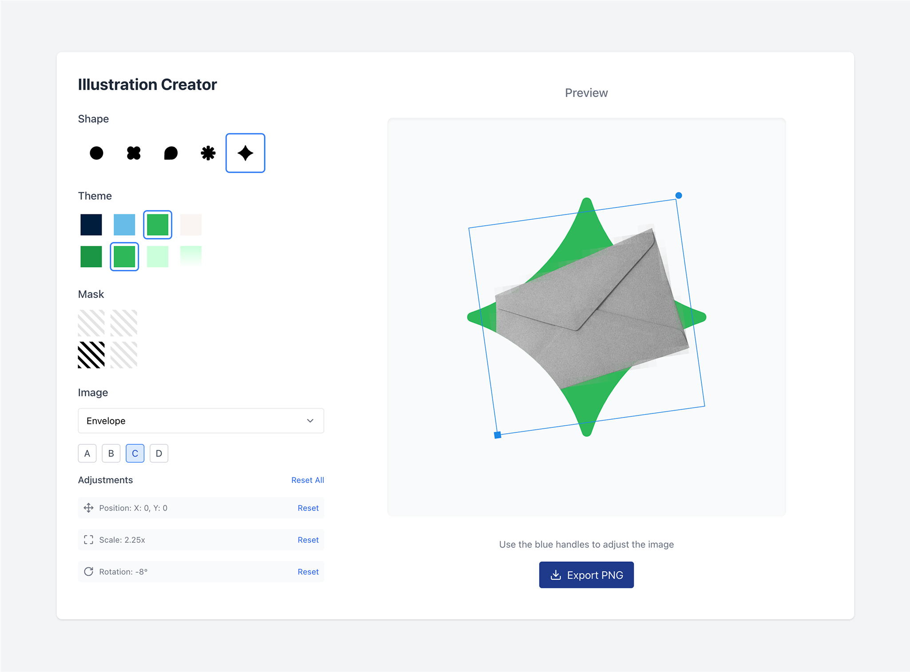

# Illustration Creator Tool

## Overview

The Illustration Creator is a web-based tool that allows users to create custom illustrations by combining pre-defined shapes, colour themes, and object images. It provides an intuitive interface for customising illustrations with precise control over positioning, scaling, and rotation, making it ideal for creating marketing assets, presentations, and social media graphics.



## Features

- **Shape Selection**: Choose from multiple shape options including Circle (Recording), Cloud, Conversation, Star (Trends), and Diamond (Insights)
- **Theme Selection**: Apply brand colours with different variations (Standard, Emphasis, Subtle, Gradient)
- **Mask Controls**: Toggle visibility of different quadrants for creative mask effects
- **Object Selection**: Browse and search through a library of object images
- **Interactive Controls**: 
  - Directly manipulate objects with intuitive handles
  - Drag to position objects
  - Scale using the bottom-left handle
  - Rotate using the top-right handle
- **Real-time Preview**: See changes instantly as you adjust settings
- **Export**: Generate high-quality PNG images with transparent backgrounds

## How It Works

The tool uses SVG for rendering shapes and applying masks, allowing for precise control and high-quality output. The architecture is component-based, with clear separation between the control panel and preview area.

### Technical Details

- **React Components**: Built with modular React components for maintainability
- **SVG Rendering**: Uses SVG for shapes, masks, and transformations
- **Interactive Handles**: Custom implementation for direct manipulation of objects
- **PNG Export**: Converts SVG to Canvas to PNG for downloading illustrations

## How to Use

1. **Select a Shape**: Click on one of the shape options (Circle, Cloud, Conversation, Star, Diamond)
2. **Choose a Theme**: Select a colour theme and variation to apply to the shape
3. **Adjust Mask**: Toggle quadrant visibility to create interesting masking effects
4. **Select an Object**: Choose an object image from the dropdown menu
5. **Position the Object**: 
   - Click on the image to select it (blue handles will appear)
   - Drag the image to position it within the shape
   - Use the bottom-left square handle to resize
   - Use the top-right circular handle to rotate
6. **Export**: Click the "Export PNG" button to download your creation

## Installation and Setup

### Prerequisites
- Node.js 14.x or higher
- npm or yarn

### Installation

1. Clone the repository:
   ```
   git clone https://github.com/noureddinemade/dub-illustration-maker.git
   ```

2. Navigate to the project directory:
   ```
   cd illustration-creator
   ```

3. Install dependencies:
   ```
   npm install
   ```
   or
   ```
   yarn install
   ```

4. Start the development server:
   ```
   npm start
   ```
   or
   ```
   yarn start
   ```

5. Open http://localhost:3000 in your browser

## Project Structure

```
/src
  /components
    /IllustrationCreator
      /index.jsx         # Main component
      /ShapeSelector.jsx # Shape selection control
      /ThemeSelector.jsx # Theme selection control
      /MaskControls.jsx  # Mask quadrant toggles
      /ImageControls.jsx # Object selection and adjustments
      /Preview.jsx       # Preview and export functionality
  /constants
    /colours.js          # Theme definitions
    /images.js           # Object image definitions
    /masks.js            # Mask path definitions
    /shapes.js           # Shape path definitions
  /utils
    /generateImages.js   # Utility for organising images
```

## Customisation

### Adding New Shapes

Add new shapes to the `shapes.js` file following this format:

```javascript
newShape: {
  name: 'Shape Name',
  path: 'SVG path data',
  viewBox: '0 0 1200 1200',
  center: { x: 600, y: 600 },
  imageDefaults: {
    x: 460,
    y: 460,
    width: 280,
    height: 280
  },
  maskPaths: {
    base: 'SVG path for base mask',
    quadrants: {
      topLeft: 'SVG path for top-left quadrant',
      topRight: 'SVG path for top-right quadrant',
      bottomLeft: 'SVG path for bottom-left quadrant',
      bottomRight: 'SVG path for bottom-right quadrant'
    }
  }
}
```

### Adding New Themes

Add new themes to the `colours.js` file:

```javascript
newTheme: {
  name: 'Theme Name',
  emphasis: '#hexColour',
  standard: '#hexColour',
  subtle: '#hexColour',
  gradient: {
    color: '#hexColour',
    type: 'linear',
    stops: [
      { offset: '0%', opacity: '1' },
      { offset: '100%', opacity: '0' }
    ]
  }
}
```

### Adding New Object Images

Place new images in the `/public/images` directory and update the images list in the appropriate file.